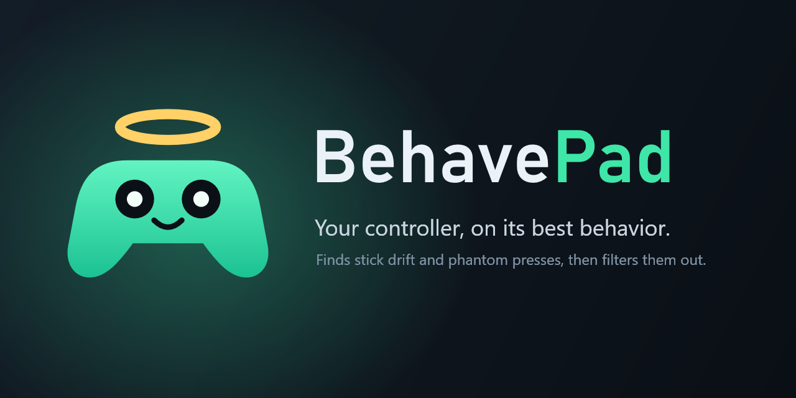
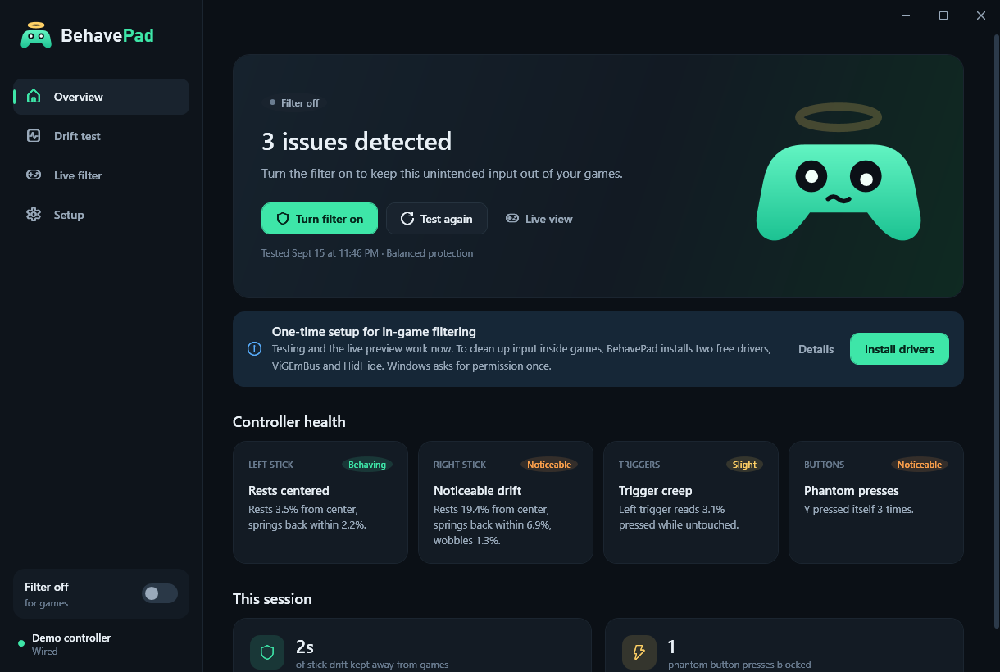
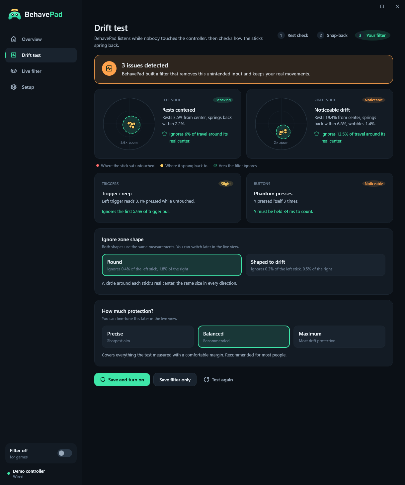
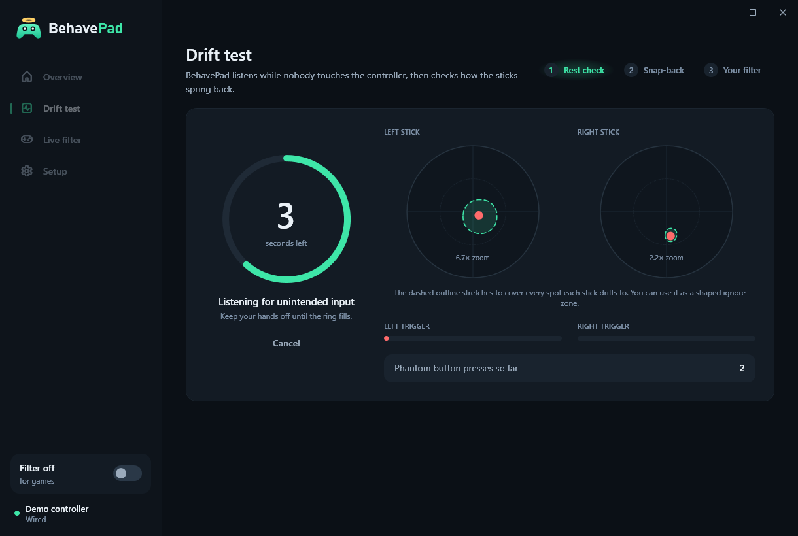
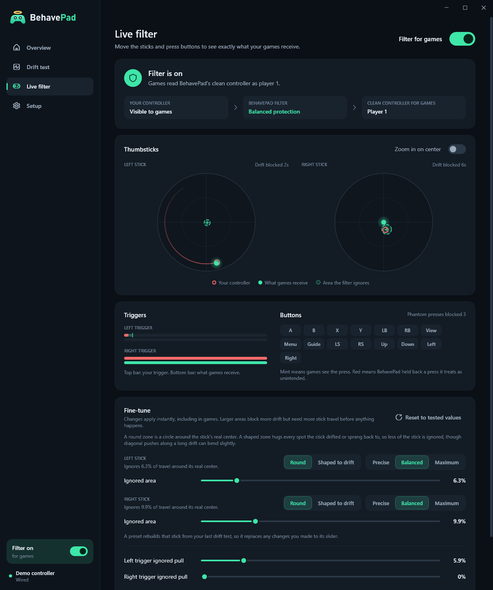
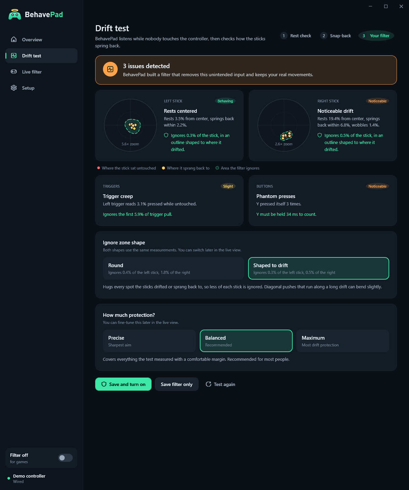
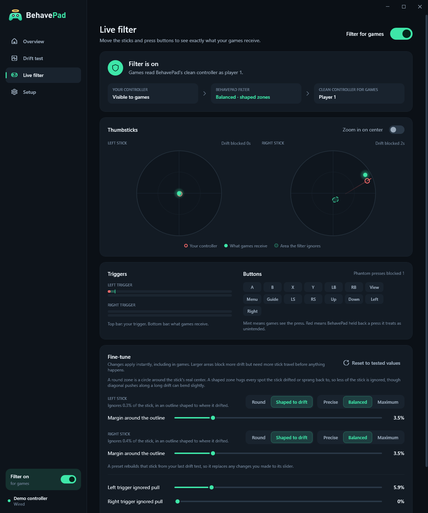

<p align="center">
  
</p>

# BehavePad

BehavePad finds unintended input from an Xbox controller that is lying still, then filters it out while you play.
It catches stick drift, sticks that spring back to a different spot each time, trigger creep, and buttons that press themselves.

It runs on Windows 10 and 11 and works with any XInput controller: Xbox One, Xbox Series X|S, Xbox 360 and most compatible pads.

## How it works

1. **Test.** You set the controller down and let go. BehavePad records every stick, trigger and button for a few seconds. Then you flick each stick to the edge and release it six times, so BehavePad can see where worn springs come to rest.
2. **Build a filter.** BehavePad measures how far each stick sits from center, how much it wobbles, and how far its rest spot wanders. It then builds a filter for that exact controller:
   - a new center for each stick at its real rest position, with both edges still reaching full travel,
   - an ignore zone just big enough to cover the measured drift, with a smooth ramp so small movements still register. It is round by default, or shaped to the drift (see below),
   - a small hysteresis band so the stick doesn't flicker at the deadzone edge,
   - a trigger deadzone that covers any resting pressure,
   - a short press delay for buttons that pressed themselves, and a block for buttons that are stuck down.
3. **Play.** BehavePad reads the real controller about 1,000 times a second and passes the cleaned input to a virtual Xbox controller. Games read the virtual one, and rumble from games is passed back to the real controller. HidHide hides the original controller from games, so the drift can't sneak back in.

You pick how much protection you want, and each stick can use its own preset:

| Level | Best for |
| --- | --- |
| Precise | The sharpest aim. A badly worn stick may still creep now and then. |
| Balanced | Most people. It covers everything the test measured with a comfortable margin. |
| Maximum | Controllers whose drift grows as they warm up or wear further. |

Every value can be fine-tuned on the Live filter page, and changes apply instantly.

### Shaped ignore zones

A round zone has to reach the drift's farthest point in every direction. A stick that drifts along a line, for example one that springs back below center and then creeps far upward, needs a huge circle that swallows most of the stick.

A shaped zone follows the drift instead. While the test runs, BehavePad draws an outline around every spot each stick sits or springs back to. It then adds a margin for the protection level you pick. Each push is measured from the nearest edge of that outline, so every direction still reaches full deflection. A shaped zone never ignores more of the stick than the largest round zone can. Each stick can use either shape. Pick them on the test results or on the Live filter page.

With a shaped zone you can also turn on **Learn drift while you play**. It grows the zone only when a stick you let go of creeps somewhere new while every other control is idle, and only after the same spot turns up following two separate releases. It never reaches more than 30% past the tested zone, and **Forget what it learned** undoes it. It stays off by default because a slow, deliberate push made right after letting go looks the same as creep.

## Screenshots

| Overview | Drift test results |
| --- | --- |
|  |  |

| Rest check | Live filter |
| --- | --- |
|  |  |

| Results with a shaped zone | Live filter with a shaped zone |
| --- | --- |
|  |  |

## Install

1. Download `BehavePad.exe` from the [latest release](https://github.com/SpeedyNabz/BehavePad/releases/latest) and run it. Testing and the live preview work straight away.
2. To filter inside games, BehavePad needs two free, open-source drivers from Nefarius Software Solutions. Choose **Install drivers** on the Overview or Setup page, or just turn the filter on, and BehavePad installs them for you.
   - [ViGEmBus](https://github.com/nefarius/ViGEmBus) creates the virtual controller games read. It is required.
   - [HidHide](https://github.com/nefarius/HidHide) hides the original controller from games. It is strongly recommended.
3. Restart your PC if BehavePad asks you to.

BehavePad downloads the official installers from GitHub, checks that each one is exactly the file it expects, and runs them silently after Windows asks for permission once. If you'd rather install the drivers yourself, the Setup page links to both.

BehavePad keeps itself up to date. It checks its GitHub releases once a day, downloads the new build in the background, checks it against the checksum GitHub published, and installs it the next time you exit. To update on the spot, or to turn this off, see **Updates** on the Setup page. Your settings, last test and filter are kept.

No controller at hand? Turn on **Use the demo controller** in Setup. It has right stick drift, a creeping left trigger and a Y button that presses itself.

## Everyday use

- Turn the filter on from the sidebar switch, the Overview page, or the notification area icon.
- Closing the window while the filter is on keeps BehavePad running in the notification area.
- Setup can turn the filter on automatically and start BehavePad when you sign in.
- Restart any game that was already open when you turned the filter on, so it picks up the clean controller.

Hiding a controller needs administrator rights, so Windows asks for permission when the filter turns on and off. Choose **Restart as administrator** in Setup to skip those prompts.

## Troubleshooting

- **BehavePad couldn't install the drivers.** Check your internet connection and choose **Install drivers** on the Setup page again. If another installation is running, wait for it to finish first. You can also install ViGEmBus and HidHide yourself from the links on the Setup page.
- **A game can't see my controller after BehavePad closed unexpectedly.** Open BehavePad. It restores the controller on startup. You can also use **Restore controller visibility** in Setup.
- **The game still reacts to drift.** A game that was already open when the filter turned on keeps reading your original controller, because hiding only takes effect the next time something opens it. Unplug the controller, plug it back in, then restart the game. Check too that HidHide is installed and that the Live filter page says the original controller is hidden.
- **The virtual controller shows up as player 2.** That is expected while the original controller is connected. Most games accept input from any player slot.
- **Some games that use Microsoft's GameInput API may still see the original controller.** That is a HidHide limitation.
- **My stick got worse.** Run the drift test again. Each test replaces the previous filter.
- **Games still see the original controller right after installing HidHide.** HidHide only attaches to controllers connected after it was installed. BehavePad reconnects the controller once when the filter turns on. If a message says HidHide isn't active yet, unplug the controller and plug it back in, or restart your PC.
- **The test says a stick drifts too far for a filter.** BehavePad never ignores more than 45% of a stick's travel, because a larger deadzone would make the stick unusable. Some drift gets through at that point, and replacing the thumbstick is the lasting fix. If the drift runs along a line, try the shaped zone. It often covers drift that a circle can't.

BehavePad keeps its settings, last test and filter in `%AppData%\BehavePad`. Nothing leaves your PC.

## Build from source

Requirements are the .NET 10 SDK on Windows.

```powershell
dotnet build BehavePad.slnx
dotnet test tests/BehavePad.Core.Tests
dotnet run --project src/BehavePad
```

Run with `--demo` to use the demo controller without changing saved settings.

To publish a single self-contained executable:

```powershell
dotnet publish src/BehavePad -c Release -r win-x64 --self-contained -p:PublishSingleFile=true -p:IncludeNativeLibrariesForSelfExtract=true -o publish
```

The icon and brand artwork are generated from vector code in `src/BehavePad/Branding/BrandArt.cs`:

```powershell
dotnet run --project tools/BrandKit
```

To regenerate the screenshots with the demo controller, without touching your own settings:

```powershell
$env:BEHAVEPAD_DATA_DIR = "$env:TEMP\behavepad-tour"
dotnet run --project src/BehavePad -- --demo --capture-tour docs/tour
```

### Project layout

| Folder | Contents |
| --- | --- |
| `src/BehavePad.Core` | Controller input, the drift test recorders and analyzer, the filter, and the polling engine. It has no UI code. |
| `src/BehavePad` | The WPF app: views, view models, the ViGEmBus virtual controller, HidHide integration and the tray icon. |
| `tests/BehavePad.Core.Tests` | Unit tests for the analyzer, the filter math, the recorders, storage and the engine. |
| `tools/BrandKit` | Renders the app icon and brand images. |
| `assets/brand` | Logo, icon and banner images. |

## Credits

BehavePad uses [ViGEmBus, HidHide and their .NET libraries](https://github.com/nefarius) by Nefarius Software Solutions, and the [.NET Community Toolkit](https://github.com/CommunityToolkit/dotnet).
Xbox is a trademark of Microsoft. BehavePad is an independent project and is not affiliated with Microsoft.

## License

BehavePad is released under the [MIT License](LICENSE).
