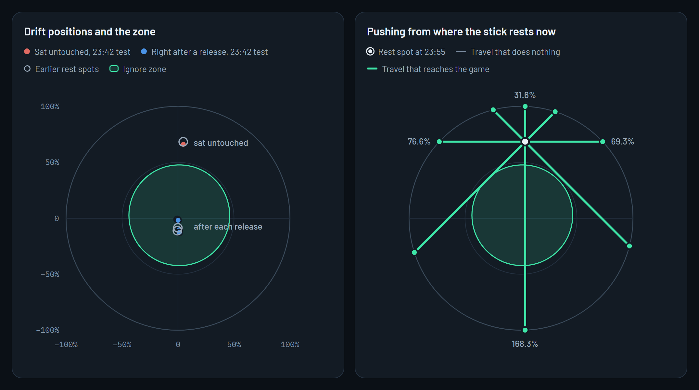
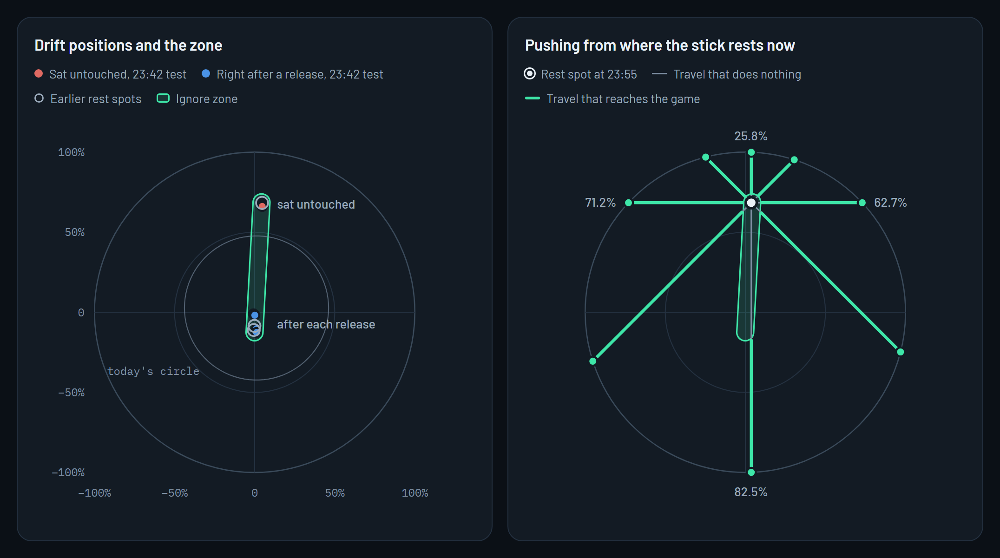
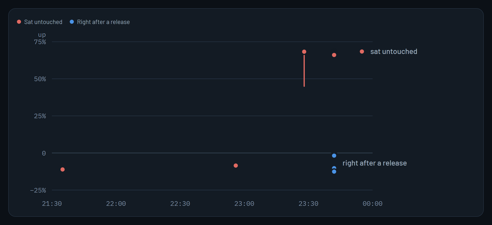

# Ignore zone study

BehavePad 1.0.1 · wired Xbox Series controller · 14 September 2026

This controller's right stick drifts along a single line. It springs back just below center after each release, then creeps far upward while nobody touches it. This study measures what that drift does to games, and whether an ignore zone shaped to the drift can block it without giving up the rest of the stick.

| Measure | Capsule along the drift | Today's circle |
| --- | ---: | ---: |
| Stick area ignored | 3.0% | 20.2% |
| Drift leaking at rest | 0% | 100% |
| Upward travel still usable | 25.8% | 31.6%, while leaking |

All positions are shares of full stick travel, with up and right positive. "Today's circle" is the filter BehavePad 1.0.1 built from the drift test.

## The stick gate

Each image shows the right stick's full range of movement, seen from above. The left panel plots where the stick sat, together with the ignore zone. The right panel pushes the stick from where it rested at 23:55. Grey is travel that does nothing, and green is travel that reaches the game.

### Today's circle

BehavePad's current filter. It is capped at the largest safe size, so the stick's untouched position sits outside it and drift leaks through.

### Capsule along the drift

The capsule follows the drift line. It blocks every untouched position measured and ignores very little else.

Coral points are where the stick sat untouched during the 23:42 drift test. Blue points are where it landed right after each release. Hollow rings mark earlier rest spots. The numbers on the right panel are usable travel straight up, right, down and left.

## How the drift moved during the evening

The right stick started slightly below center, then began creeping upward and swinging between 45% and 68% up. After each release in the 23:42 test it dropped back just below center before creeping up again.

| Time | Reading | Up-down position |
| --- | --- | --- |
| About 21:35 | First check | 11.1% down |
| 22:56 | Tour rest check | 8.5% down |
| 23:28 | Direction check, 30 seconds | 45.0% to 68.3% up |
| 23:42 | Drift test, after each release | 1.0% to 12.6% down |
| 23:42 | Drift test, untouched | 66.1% to 68.6% up |
| 23:55 | Live check, 45 seconds | 68.4% up |

A drift test at 23:10 recorded an untouched position 44.6% from center but did not store its direction, so it is not plotted.

## What games received at 23:55

Measured over 45 seconds, with the controller untouched and BehavePad 1.0.1 filtering. Each row is how far the right stick reads upward.

| Source | Right stick reads |
| --- | ---: |
| Your controller, still visible to games | 68.5% up |
| BehavePad's virtual controller, with the filter and drift guard on | 20.2% up |
| The saved filter with the drift guard off, replaying the same samples | 43.4% up |

- HidHide was not attached to the controller yet, so games could still read it directly. Unplugging the controller once and plugging it back in attaches HidHide.
- The drift guard followed the creep partway, which is why the virtual controller reads lower than the replay. It stops once it has moved 30% from the tested center.
- The left stick rested 1.3% from center, and the filter removed all of it.

## Shapes compared

Every shape was fitted to the 23:42 drift test with the same 4% margin, then checked against the 23:55 readings and three earlier rest spots.

| Ignore zone | Stick area ignored | Drift leaking at rest | Earlier rest spots covered | Usable travel up · right · left · down | Worst direction error |
| --- | ---: | ---: | ---: | --- | ---: |
| Today's circle | 20.2% | 100% | 2 of 3 | 31.6 · 69.3 · 76.6 · 168.3% | 45° |
| Circle that covers the drift | 32.7% | 0% | 3 of 3 | 2.0 · 19.3 · 25.8 · 82.3% | 22° |
| Capsule along the drift | 3.0% | 0% | 3 of 3 | 25.8 · 62.7 · 71.2 · 82.5% | 42° |
| Rounded outline | 2.6% | 0% | 3 of 3 | 27.2 · 63.5 · 72.8 · 83.1% | 42° |

- Travel is measured from where the stick rests now, near the top of its range, so pushing down can cover more than a full radius.
- Direction error is how far a push's output bends away from the push. The capsule and outline only bend the two downward diagonals, whose vertical part runs along the drift line. Their other six directions stay within 4°.
- An ellipse along the drift ignored 3.5% of the stick but kept only 12.8% of upward travel, because it measures output from its center rather than from the drift line.

## Letting the zone learn during play

A zone that grows while you play could follow drift that gets worse. The risk is learning a push you meant. These simulations held the stick deliberately upward with nothing else touched.

| Learning rule | 6-second hold | 30-second hold |
| --- | --- | --- |
| After 1.5 s held still near the drift line | Learned it | Learned it |
| After 20 s near the line, every other control idle | Ignored it | Learned it |

Learning the 30-second hold took upward travel from 25.8% to none. A safer signal may be how the stick arrives at a spot: creep follows a release slowly, while deliberate input arrives fast. Confirming that needs a recording of the creep's path, which this study does not have yet.

## Building the capsule

- **Filter.** Fit a capsule to the drift test's rest and snap-back positions. Measure output from the nearest point on its center line, and save it in the filter profile under a new format version.
- **App.** Draw the zone on the results and Live filter plots, and replace the fine-tune radius with length and width. Healthy sticks keep a circle.
- **Learning.** Off by default. Limited to slow arrivals right after a release with every other control idle, capped in size, and resettable.

Ship the fitted capsule first and hold learning until the creep is recorded. No zone can give back upward range on this stick, so replacing the right thumbstick remains the lasting fix.

## Follow-up: shaped zones in BehavePad, 15 September 2026

BehavePad now builds the rounded outline from this study as a second ignore zone shape, called "Shaped to drift". Round stays the default.

- **Building it.** While the rest check and snap-back check run, BehavePad draws an outline around every spot each stick sits or springs back to. The outline stays convex, so output never jumps. The protection level adds a margin: 2% for Precise, 3.5% for Balanced and 6% for Maximum.
- **Using it.** A push is measured from the nearest edge of the outline and scaled so every direction still reaches full output. No shaped zone ignores more of the stick than the largest circle does.
- **Switching.** Both shapes come from the same test, so switching needs no new test. Filters saved before shaped zones get a zone the size of their circle until the drift test runs again.

### This stick, replayed

Each zone was built from the 23:42 drift test, then checked against the 23:55 rest spot and the three earlier rest spots.

| Ignore zone | Stick area ignored | Drift leaking at rest | Earlier rest spots covered | Usable travel up · right · left · down |
| --- | ---: | ---: | ---: | --- |
| Round, Balanced | 20.2% | 100% | 2 of 3 | 31.5 · 68.2 · 77.6 · 168.3% |
| Shaped, Precise | 1.4% | 0% | 3 of 3 | 27.5 · 64.2 · 73.6 · 92.3% |
| Shaped, Balanced | 2.3% | 0% | 3 of 3 | 26.5 · 63.2 · 72.6 · 83.3% |
| Shaped, Maximum | 3.7% | 0% | 3 of 3 | 23.5 · 60.2 · 69.6 · 80.3% |

- The shaped zones bend output the same way the rounded outline did: within 4° in six directions, and about 40° on the two downward diagonals.
- The 3,598 readings from 23:55 were not kept. Leak here is measured against the 23:55 rest spot with a 0.3% wobble added.

### Learning during play

Shaped zones can also grow during play. Learning is off by default and follows the limits this study proposed:

- It only watches a stick right after a release: pushed at least 40% past the zone, back within 250 ms, then still.
- It follows movement slower than about a third of full travel per second while every other control is idle.
- A spot counts once the stick creeps there again after a second, separate release.
- Growth has to connect to the zone and stops 30% past the tested zone.

These simulations use a stick tested at 3% right and 10% down whose drift has since worsened. After each release it creeps to 10% up. Each scenario ran five times unless noted.

| Scenario | Learned |
| --- | --- |
| Creeps after a release | After the second release. Leak at the creep spot fell from 100% to 0%, and upward travel from 105% to 89% |
| The same, with 1.5% sensor wobble | Yes |
| Creeps while a trigger is held | No |
| Quick push after a release, held 6 s or 30 s | No |
| Slow push at half of full travel per second, held 5 s | No |
| Slow push at a fifth of full travel per second right after a release, to the same spot | Yes, after two |
| Slow tilt with no release | No |
| Thumb eases the stick back over 0.7 s, then it creeps | No |
| Thumb snaps the stick back in 80 ms, then it creeps | Yes |
| Set down once and left to creep for 10 minutes | No |
| Creeps to 70% up | Grows only as far as the 30% limit |

Learning catches drift that returns after releases and ignores the held pushes this study worried about. It can't tell creep from a slow push made right after letting go, or from a thumb that snaps the stick back as fast as a spring. It also never learns from a controller that is set down and left alone. A recording of this stick's creep would still help tune the speed limit.

## Method and data

BehavePad Core replayed every reading. Zones were fitted to the 11 untouched positions and 6 snap-back positions from the 23:42 drift test, each with a 4% margin. Leak was measured against 3,598 readings taken at 23:55. Stick area ignored comes from 120,000 random positions across the gate. Usable travel steps outward from the 23:55 rest spot in each direction until output starts, then measures what remains to the edge of the gate. Direction error is sampled at 90% of that remaining travel.

### Zone geometry

| Zone | Shape |
| --- | --- |
| Today's circle | Center 1.2% right, 2.7% up; radius 45.0% |
| Circle that covers the drift | Center 3.3% right, 40.7% up; radius 57.3% |
| Capsule along the drift | From 0.1% left, 12.5% down to 4.3% right, 68.6% up; radius 5.3% |
| Rounded outline | Outline of the 23:42 positions, grown by 4.0% |

### Drift positions

| Reading | Left-right | Up-down |
| --- | --- | --- |
| Sat untouched, 23:42 | 4.7% right | 68.6% up |
| Sat untouched, 23:42 | 4.7% right | 68.2% up |
| Sat untouched, 23:42 | 4.7% right | 68.1% up |
| Sat untouched, 23:42 | 4.7% right | 67.8% up |
| Sat untouched, 23:42 | 4.7% right | 67.6% up |
| Sat untouched, 23:42 | 4.7% right | 67.3% up |
| Sat untouched, 23:42 | 4.7% right | 67.0% up |
| Sat untouched, 23:42 | 4.7% right | 66.7% up |
| Sat untouched, 23:42 | 4.7% right | 66.6% up |
| Sat untouched, 23:42 | 4.7% right | 66.4% up |
| Sat untouched, 23:42 | 4.7% right | 66.1% up |
| After a release, 23:42 | 0.6% right | 11.5% down |
| After a release, 23:42 | 0.7% left | 1.0% down |
| After a release, 23:42 | 1.1% right | 12.1% down |
| After a release, 23:42 | 0.1% right | 1.8% down |
| After a release, 23:42 | 1.1% right | 10.3% down |
| After a release, 23:42 | 1.2% right | 12.6% down |
| First check, about 21:35 | 0.6% left | 11.1% down |
| Tour rest check, 22:56 | 0.1% left | 8.5% down |
| Direction check, 23:28 | 4.7% right | 68.3% up |

### Usable travel and direction error by direction

Each cell is usable travel from the 23:55 rest spot, then how far the output bends away from the push.

| Direction | Today's circle | Circle that covers the drift | Capsule along the drift | Rounded outline |
| --- | --- | --- | --- | --- |
| Up | 31.6%, 2° | 2.0%, 0° | 25.8%, 1° | 27.2%, 2° |
| Up-right | 38.0%, 28° | 3.8%, 19° | 31.6%, 0° | 32.6%, 1° |
| Right | 69.3%, 45° | 19.3%, 22° | 62.7%, 0° | 63.5%, 0° |
| Down-right | 131.8%, 33° | 58.2%, 11° | 122.8%, 42° | 123.8%, 42° |
| Down | 168.3%, 2° | 82.3%, 0° | 82.5%, 3° | 83.1%, 2° |
| Down-left | 139.8%, 30° | 65.4%, 10° | 131.6%, 39° | 134.0%, 38° |
| Left | 76.6%, 45° | 25.8%, 21° | 71.2%, 3° | 72.8%, 4° |
| Up-left | 40.3%, 31° | 5.7%, 19° | 34.9%, 1° | 36.5%, 1° |

Measured on a wired Xbox Series controller with BehavePad 1.0.1, ViGEmBus and HidHide on Windows 11.
